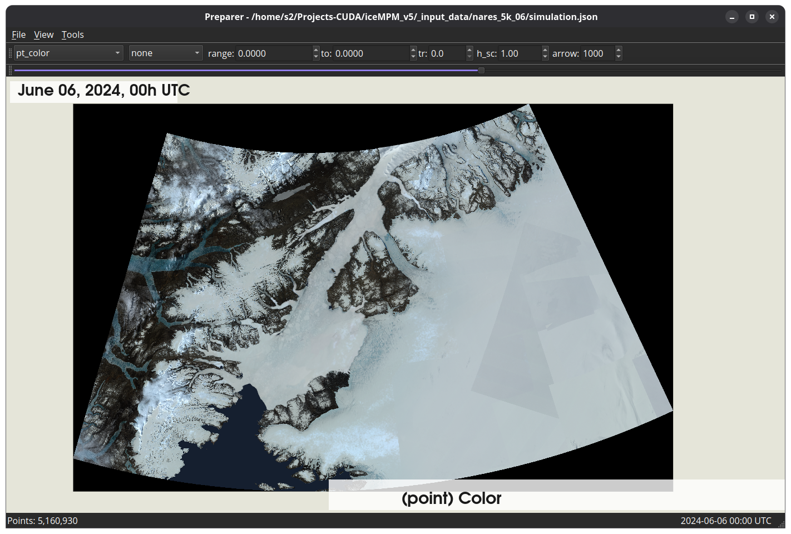
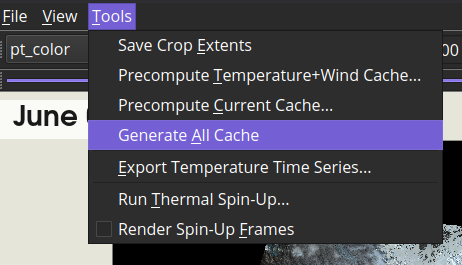
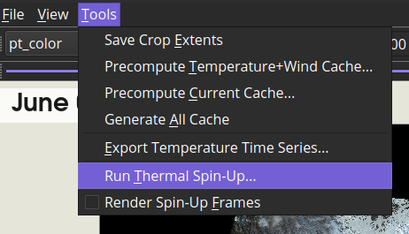
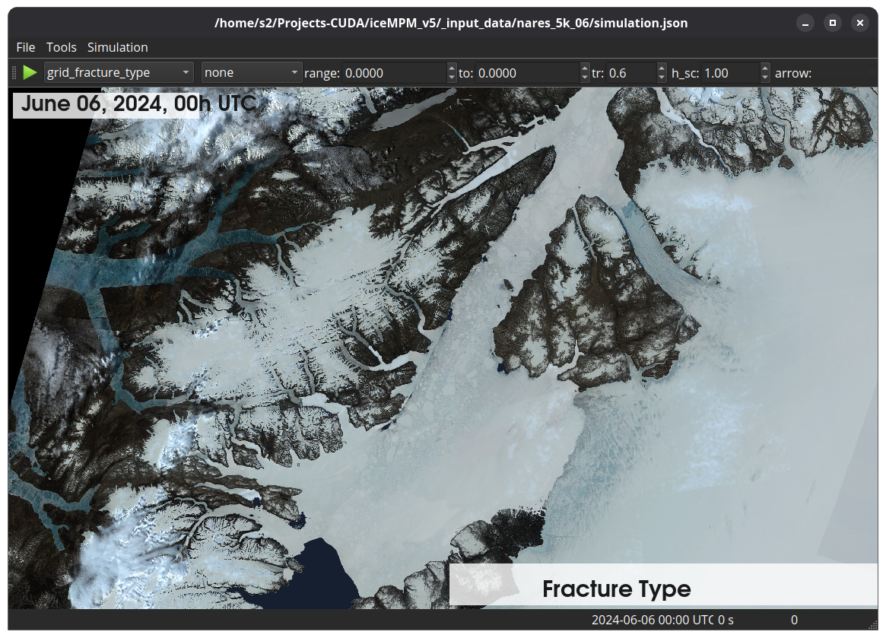
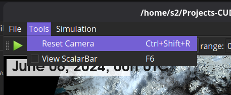
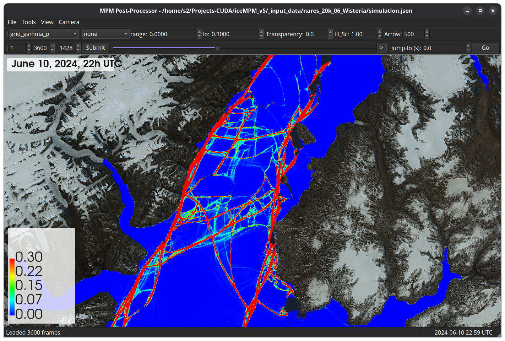
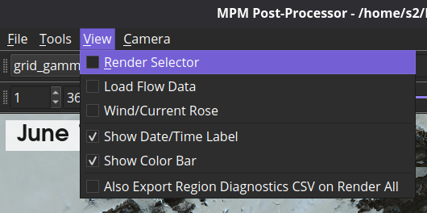
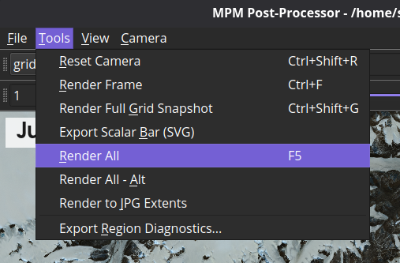

# iceMPM

A material point method (MPM) simulation of sea ice, developed to reproduce
the June 2024 breakup of the Nares Strait ice arch/bridge from
reanalysis-driven forcing (CARRA1 atmosphere, GLO12 ocean). See the paper,
*Reproducing Nares Strait Sea Ice Breakup by Reanalysis-Driven Material
Point Method* (Gribanov & Waseda), for the physics and validation
(`_paper/`; citation to follow once published).

This repository contains the full pipeline: preparing a simulation's initial
grid/point geometry from satellite imagery and reanalysis data, running the
MPM simulation itself (on a workstation GPU or an HPC cluster), and
visualizing/exporting the results. The code and file formats are frozen as
of the paper submission — this README is aimed at someone downloading the
repository to build it and reproduce the simulations from scratch.

## Contents

- [Requirements](#requirements)
- [Building](#building)
- [Repository layout](#repository-layout)
- [Obtaining input data](#obtaining-input-data)
- [Configuration (`.json`) files](#configuration-json-files)
- [Running the pipeline end to end](#running-the-pipeline-end-to-end)
- [GUI reference](#gui-reference)
- [Running on an HPC cluster](#running-on-an-hpc-cluster)
- [Troubleshooting](#troubleshooting)
- [License](#license)

## Requirements

**OS**: Linux only. Everything here (CMakeLists.txt, the scripts, the paths)
targets Ubuntu; there is no Windows/macOS support.

**Compiler/build tools**: C++20, CMake ≥ 3.20.2.

**CUDA**: required to build `gplate`/`cplate` (the targets that compile
`simulation/kernels.cu`); not needed for `preparer`/`preparer_cli`/
`visualizer`. The code doesn't rely on cutting-edge CUDA features — it's
been run on an RTX 4090 (compute capability 8.9) and an RTX 3070 (8.6).
Older cards such as an RTX 2060 (7.5, Turing) are expected to work but run
notably slower, since they lack the newer per-warp combined `atomicAdd`
behavior the code benefits from on Ampere/Ada — that's a performance
difference, not a correctness one. `CMakeLists.txt` currently targets
`CUDA_ARCHITECTURES "80;89"`; edit that if your GPU is a different
generation and PTX JIT fallback isn't fast enough for you.

**GPU**: an NVIDIA GPU is required only for `gplate`/`cplate`.
`preparer`/`preparer_cli`/`visualizer` need no GPU at all (the preparer's
Kelvin-wake computation runs on CPU via OpenMP).

**RAM**: data *preparation* (`preparer`/`preparer_cli`, building `grid.h5`
from the basemap image + masks) is the memory-heavy step. Budget **64 GB**
for the 20K-resolution setups; **16 GB** is enough for the 10K setups.

**Libraries** — what this project is built and tested against (not
necessarily hard minimums, just what's confirmed to work):

| Library | Version used |
|---|---|
| GCC | 15.2.0 |
| CUDA Toolkit | 13.1 |
| Qt | 6.10.2 (Qt5 also supported by CMakeLists.txt's fallback) |
| VTK | 9.5.2 |
| HDF5 | 1.14.6 |
| netCDF-C / netCDF-C++4 | 4.9.3 / 4.3.1 |
| Eigen3 | header-only, any recent version |
| spdlog | 1.15.3 |
| fmt | 10.1.1 |
| libpng | 1.6.57 |
| OpenMP (`libgomp`) | whatever ships with GCC |

Qt and VTK are only needed for the GUI targets (`gplate`, `preparer`,
`visualizer`) — see [Building](#building). OpenMP is required by every
target (preparer's CPU-side Kelvin-wake computation and several other
loops use it); it normally ships with GCC, so a plain
`build-essential`-equivalent install already covers it — nothing extra to
install on most systems. `cxxopts` and `rapidjson` are **vendored** under
`External/` (no `libcxxopts-dev`/`rapidjson-dev` package needed, and no
`find_package` call for either — the headers are included directly from
the repo).

**Known toolchain caveat**: CUDA 13.1's own `host_config.h` accepts GCC up
to 15, but building against the newer glibc shipped on Ubuntu 26.04 can
still fail with an exception-specification error in CUDA's
`math_functions.h` (incompatible `noexcept` declarations for `rsqrt`/
`rsqrtf`) — a known CUDA 13.1 + modern-glibc issue, not specific to this
project (see
[llama.cpp#19100](https://github.com/ggml-org/llama.cpp/issues/19100) and
[this Stack Overflow thread](https://stackoverflow.com/questions/79938413/compilation-with-cuda-fails-execption-specification-is-incompatible-with-that-o)).
The fix is to patch the CUDA math header to add `noexcept(true)` to the
affected declarations. This is a distro/CUDA-version interaction, not
something to work around in this repo's own code.

## Building

Build targets are controlled by CMake options, quoted directly from
`CMakeLists.txt`:

```cmake
option(BUILD_CLI_VERSION   "Build CLI version"                     ON)
option(BUILD_GUI_VERSION   "Build Qt version"                      OFF)
option(BUILD_VISUALIZER    "Build the tool for visualization"      OFF)
option(BUILD_PREPARER      "Build the tool for preparing the data" OFF)
option(BUILD_PREPARER_CLI  "Build the CLI tool for preparing the data" OFF)
```

| Option | Target | Needs Qt/VTK? |
|---|---|---|
| `BUILD_CLI_VERSION` (default **ON**) | `cplate` | No |
| `BUILD_PREPARER_CLI` | `preparer_cli` | No |
| `BUILD_GUI_VERSION` | `gplate` | Yes |
| `BUILD_VISUALIZER` | `visualizer` | Yes |
| `BUILD_PREPARER` | `preparer` | Yes |

The GUI-needing options default OFF because this project's default build
target is a headless server with no Qt/VTK installed (e.g. an HPC login
node) — `cplate` alone builds out of the box there. On a desktop with the
GUI libraries available, turn the others on explicitly.

**Headless / HPC build** (defaults are already right):
```bash
cmake -B build
cmake --build build -j
```

**Desktop build** (everything):
```bash
cmake -B build -DBUILD_GUI_VERSION=ON -DBUILD_VISUALIZER=ON -DBUILD_PREPARER=ON -DBUILD_PREPARER_CLI=ON
cmake --build build -j
```

If your GPU isn't compute capability 8.0 or 8.9, edit the
`CUDA_ARCHITECTURES` property set on the `gplate`/`cplate` targets in
`CMakeLists.txt` to match.

If netCDF isn't found by `find_package`, check whether it's available as a
CMake config package first — `CMakeLists.txt` deliberately tries that
before falling back to pkg-config, since the CMake-config path is what
works on Wisteria-class HPC systems.

## Repository layout

```
simulation/       shared simulation core + CUDA kernels (used by gplate, cplate)
gui/main.cpp -> gplate       GUI simulation runner (Qt + VTK)
cli/main.cpp -> cplate       CLI simulation runner (no Qt/VTK; HPC-friendly)
preparer/                    GUI grid/point-geometry preparation tool (Qt + VTK)
preparer/cli -> preparer_cli CLI equivalent of preparer (no Qt/VTK; HPC-friendly)
visualizer/                  GUI post-processing viewer (Qt + VTK)
gui/                          shared Qt/VTK widgets (incl. colormap.h/.cpp)
External/                    vendored headers (cxxopts, rapidjson, stb_image)
_input_data/                 example simulation setups + input images (see below)
_python_code/                data-download + figure pipeline (own README)
_paper/                      the paper's LaTeX source
```

`_input_data/` holds our various simulation setups (`nares_5k_06/`,
`nares_10k_06/`, `nares_20k_06/`, etc.). Each is a directory with a
`simulation.json` plus the PNG images `preparer` consumes to build the
grid/point geometry (basemap color image, ice/land/footprint/thickness/
analysis-region masks). Two shared files, `base_config.json` and
`base_config_wisteria.json`, hold the physics parameters and machine-
specific paths (`RuntimeDirectory`, `.nc` forcing-data paths) that every
per-setup `simulation.json` inherits via `"ParentConfig"` — see
[Configuration](#configuration-json-files) below.

## Obtaining input data

**Basemap images**: the 10K-resolution basemap images are checked into git
and usable as-is (e.g. `_input_data/nares_10k_06/color_06_10k.png`). The
20K image is excluded from git (too large) — download it from
[this Google Drive folder](https://drive.google.com/drive/folders/11hOpigjz4asW_Xb82wHWumbECurmeeQq?usp=sharing).

**CARRA1/GLO12 reanalysis `.nc` files**: the primary way to get these is to
register your own free API credentials with the relevant service and run
our download scripts — see
[`_python_code/GETTING_DATA.md`](_python_code/GETTING_DATA.md) for the
short, essentials-only walkthrough (credentials, which script to run, what
comes out). Those scripts are already configured for the paper's actual
2024 hindcast period, so no date editing is needed by default. As a
convenience, pre-downloaded copies of the `.nc` files are also available
from the same
[Google Drive folder](https://drive.google.com/drive/folders/11hOpigjz4asW_Xb82wHWumbECurmeeQq?usp=sharing).

Either way, these downloads are just raw inputs — the basemap image and
`.nc` files on their own are **not** simulation-ready data. `preparer`
(or `preparer_cli`) still has to run on them, pointed at by a
`simulation.json`, to build the actual grid/point geometry (`grid.h5`) the
simulation reads; see
[Running the pipeline end to end](#running-the-pipeline-end-to-end) below.

`_python_code/README.md` remains the full reference covering every script
in that directory, including the ones that regenerate the paper's figures;
`GETTING_DATA.md` only covers what a new user needs to get and check the
simulation's input data.

## Configuration (`.json`) files

Every simulation setup is a small JSON file (e.g.
`_input_data/nares_10k_06/simulation.json`) that inherits from a shared
base config via `"ParentConfig"`:

```json
{
  "ProjectName": "nares_10k_06",
  "ParentConfig": "/path/to/_input_data/base_config.json",
  "ImageColor": "color_06_10k.png",
  ...
}
```

`base_config.json` holds the physics parameters and every machine-specific
absolute path — most importantly `RuntimeDirectory`, an absolute path
**outside the repository** where all generated data goes (nothing
generated ever lands inside the repo; see
`simulation/data_manager/directory_manager.h`). A fresh clone must edit
`ParentConfig` and `RuntimeDirectory` (and the `.nc` paths below) to match
its own machine before anything will run.

Path-bearing keys and what they resolve against:

| Key | Meaning | Resolved relative to |
|---|---|---|
| `RuntimeDirectory` | where all generated data goes: `<dir>/_data` (shared cache) and `<dir>/input/<ProjectName>/{grid.h5, snapshots/, output/}` | must be absolute |
| `ImageColor`, `ImageIceMask`, `ImageLandMask`, `ImageThicknessMask`, `ImageFootprintMask`, `AnalysisRegionMask` | input PNGs consumed by `preparer` to build `grid.h5` (only `ImageColor` is required) | the config file's own directory |
| `GridData` | preparer-generated grid filename inside the project directory | project directory |
| `Snapshot` | point snapshot `cplate`/`gplate` loads to start a run | the run's snapshots directory |
| `CARRA1Data`, `GLO12Data`, `GLO12Tides`, `GLO12ThicknessData` | reanalysis forcing `.nc` files | the config file's own directory |

## Running the pipeline end to end

Worked example, project `nares_5k_06`:

1. **Configure the JSON.** In `_input_data/nares_5k_06/simulation.json`,
   confirm `"ParentConfig"` points at `_input_data/base_config.json` and
   `"ImageColor"` points at the basemap image (images can be shared across
   sibling project directories, e.g. `"../nares_5k_09/color_06_5k.png"`).
   In `base_config.json`, set `RuntimeDirectory` and the mask/`.nc` paths
   from the table above to match your machine.

2. **Run the preparer** on the *project directory* (not the JSON file
   directly — all four tools accept either and append `simulation.json`
   themselves):
   ```bash
   ./preparer ~/iceMPM_v5/_input_data/nares_5k_06/
   ```
   Loading can take a while for large geometries.

   

3. From the **Tools** menu, run **Generate All Cache**, then
   **Run Thermal Spin-Up...** — both required before simulating.

   
   

4. **Run the simulation**:
   ```bash
   ./gplate ~/iceMPM_v5/_input_data/nares_5k_06/
   ```
   

   On first load you may need **Tools → Reset Camera** (`Ctrl+Shift+R`) to
   frame the view.

   

   Start the run from the green ▶ toolbar button. This produces two kinds
   of output under `RuntimeDirectory/input/nares_5k_06/output/`: resumable
   point snapshots, and frame data for visualization only — frames alone
   cannot be used to resume a run, only snapshots can.

5. **Inspect/export with the visualizer**:
   ```bash
   ./visualizer ~/iceMPM_v5/_input_data/nares_5k_06/
   ```
   

   Use **View → Render Selector** to choose which variables get exported;
   the toolbar dropdown picks which variable is currently displayed.

   

   **Tools → Render All** (`F5`) exports frames one by one over the frame
   range set in the toolbar.

   

### Headless equivalent (`cplate`/`preparer_cli`)

For an HPC cluster with no Qt/VTK, the same steps run from the command
line:

```bash
./preparer_cli ~/iceMPM_v5/_input_data/nares_5k_06/
./cplate ~/iceMPM_v5/_input_data/nares_5k_06/
```

`preparer_cli` takes just the project directory (or a JSON file directly)
and does everything the GUI's Generate All Cache + Run Thermal Spin-Up
steps do in one pass. `cplate` accepts the same positional argument, plus
two optional flags: `-g`/`--generate-points` (generate initial points and
exit, without simulating) and `-s`/`--snapshot-only` (generate the initial
snapshot and exit).

## GUI reference

The walkthrough above covers the ordered sequence needed for a first run;
a few more menu items worth knowing about:

**`preparer`** (Tools menu): besides Generate All Cache and Run Thermal
Spin-Up, there's also *Precompute Temperature+Wind Cache* and *Precompute
Current Cache* (the two halves Generate All Cache combines), *Export
Temperature Time Series*, and *Render Spin-Up Frames* (dumps per-step
thermal spin-up diagnostic frames for inspection).

**`visualizer`** (window title "MPM Post-Processor"):
- **View** menu: *Render Selector* (choose exported variables), *Load Flow
  Data*, *Wind/Current Rose*, *Show Date/Time Label*, *Show Color Bar*
  (both hide/show on-screen overlays without affecting what gets
  exported), and *Also Export Region Diagnostics CSV on Render All*.
- **Tools** menu: *Reset Camera*, *Render Frame* (current frame only),
  *Render Full Grid Snapshot*, *Export Scalar Bar (SVG)* (standalone
  vector legend matching the active color palette), *Render All* / *Render
  All - Alt*, *Render to JPG Extents* (crop to a fixed pixel window, set
  per-project via `JPG_OffsetX/Y`/`JPG_Crop_Width/Height`), and *Export
  Region Diagnostics...* (per-frame masked-region statistics — wind/current
  drag, ice speed, ice strength, fractured fraction — as CSV; needs an
  `AnalysisRegionMask` configured).

## Running on an HPC cluster

Use `cplate` and `preparer_cli` (no Qt/VTK needed). See
[Building](#building) for the headless build, and note the netCDF
CMake-config fallback mentioned there. *(Module-load commands and a sample
job-submission script for Wisteria will be added here.)*

## Troubleshooting

This project does not silently catch and ignore exceptions — errors are
meant to crash loudly rather than continue in a bad state. A few you're
likely to see:

| Error | Cause | Fix |
|---|---|---|
| `RuntimeDirectory` accessor throws | `RuntimeDirectory` unset or empty in the config | set it in `base_config.json` |
| `Snapshot file not found` | bad/missing `Snapshot` path when starting `cplate`/`gplate` | check the path, or run with `--generate-points`/`--snapshot-only` first |
| `CARRA1 file not found` / `GLO12 file not found` | bad `.nc` path — **hard-crashes** `cplate`/`gplate` | fix the path in `base_config.json` |
| `ParentConfig` cycle error | two configs reference each other | fix the `ParentConfig` chain |

Note one deliberate divergence: a bad `.nc` path is fatal in `cplate`/
`gplate` (the simulation needs the forcing data to run correctly), but
`preparer`/`preparer_cli`/`visualizer` just log a warning and continue
without wind/current forcing — this is intentional, not a bug, since those
tools can usefully run without forcing data.

## License

Public domain (Unlicense) — see `LICENSE`.
